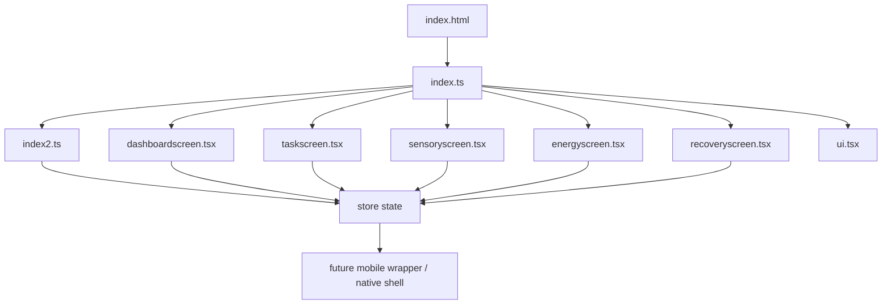

# File structure diagram

## Notes
- The current app is web-first, but the shared state and screen modules are isolated so they can be reused in a future mobile build.
- Health integrations from phones, wearables, and rings can be added as future extensions without rewriting the core experience.
